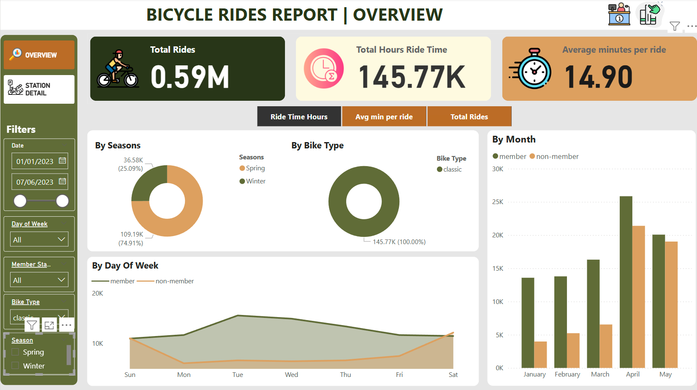
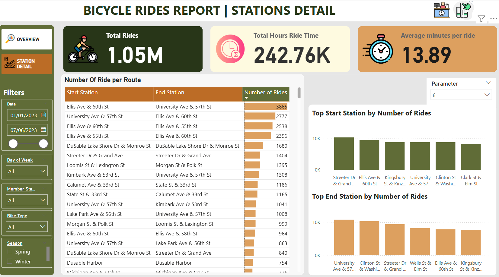
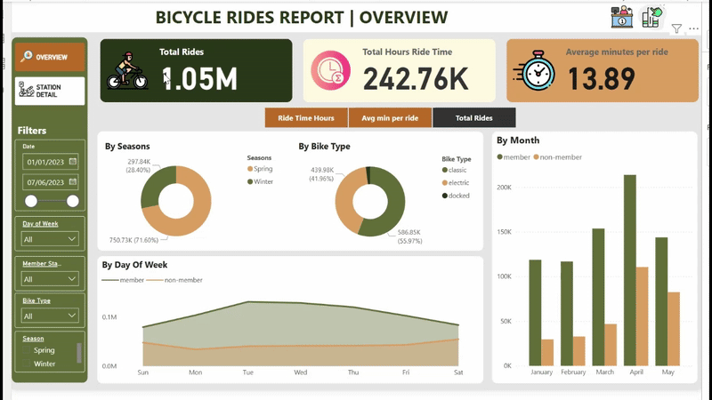
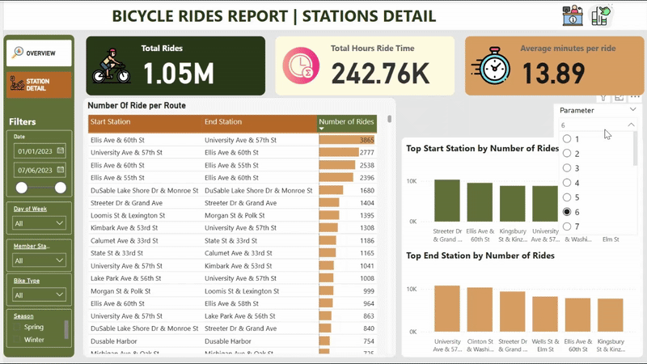

# 🚲 Bicycle Sharing Analysis — Power BI Project

## 📊 Project Overview
This Power BI report analyzes bicycle sharing data to uncover trends in usage patterns, user demographics, and trip behaviors. The dataset includes key metrics such as trip duration, user type, station activity, and temporal usage patterns. The report was built using extracting data from file **clean_td** - csv file which was retrieved from [Kaggle website](https://www.kaggle.com/datasets/whitanyaalexander/google-data-analytics-capstone-cyclistic-2023/code).

This personal project was developed to enhance my skills in data analysis, visualization, and report design using Microsoft Power BI desktop.

## 💡 Objectives
- Understand how bicycle-sharing services are used across time and demographics.
- Identify high-demand stations and peak usage periods.
- Visualize trends for operational and business decision-making.

## 🔧 Tools & Skills Used
- **Power BI Desktop**: Data transformation, DAX, and interactive dashboard creation.
- **Power Query**: Data cleaning and transformation.
- **DAX (Data Analysis Expressions)**: Custom calculations for KPIs and time intelligence.
- **Data Visualization**: Slicers, line charts, bar charts, maps, and KPI cards.

## 📌 Key Highlights
- **Dynamic Filters**: Users can filter the report by date, user type, bike type and more.
- **Top Performing Stations**: Visuals highlight the most and least popular stations based on trip counts. Users can adjust the number of stations showed in report.
- **KPI cards**: Quick view of total rides, total hours ride time, and average duration.
- **Temporal Analysis**: Usage trends shown by hour of day, day of week, and month.

## 📷 Screenshots
- 
- 
- 
- 

## 📁 Project Structure
- `Bicycle Power BI.pbix`: Main Power BI report file containing all data transformations, visuals, and DAX measures.
- `clean_td.csv`: Main dataset extracted from Kaggle that is used for this project.

## 🧠 What I Learned
- How to transform raw data into actionable insights using Power BI.
- Effective use of DAX for custom metrics and time-based analysis.
- Designing visually appealing and informative dashboards.
